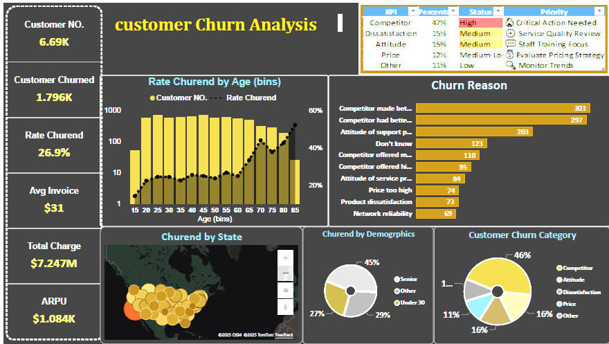

# Churn-customer
# 📊 Customer Churn Analysis Dashboard

## 🧠 Project Overview
This project focuses on **Customer Churn Analysis**, highlighting the main factors that lead customers to stop using a company's services.  
The dashboard provides deep insights into **customer behavior**, **reasons for churn**, and **key performance indicators (KPIs)** to help identify improvement opportunities.

---

## 📸 Dashboard Preview

---

## 🔍 Key Insights
- **Total Customers:** 6.69K  
- **Customers Churned:** 1.796K  
- **Churn Rate:** 26.9%  
- **Average Invoice:** $31  
- **Total Charge:** $7.247M  
- **ARPU:** $1.084K  

---

## 🧩 Analysis Breakdown
### 1️⃣ Rate Churned by Age
- Higher churn rates observed among **customers aged 55+**.
- Younger segments show lower churn, possibly due to promotional offers.

### 2️⃣ Churn Reason
- **Competitor offers** are the primary churn reason (47%).
- **Dissatisfaction** and **attitude of support staff** also impact retention.

### 3️⃣ Churn by State
- Visual map shows geographic distribution of churn.
- Southern and Western states show relatively higher churn concentration.

### 4️⃣ Demographics & Category
- 45% of churned customers are **senior**.
- 46% churn due to **competitor offers**, followed by dissatisfaction (16%) and pricing (11%).

---

## 🚀 Tools Used
- **Microsoft Power BI** — for dashboard visualization  
- **Excel / CSV Data** — for data preprocessing  
- **GitHub** — for version control and portfolio showcasing  

---

## 💬 Conclusion
This dashboard provides a clear understanding of customer churn behavior and helps businesses take **data-driven actions** to improve **customer retention** and **service quality**.

---

## 🔗 Connect with Me
If you liked this project, check it out on:
- 🌐 **GitHub:** [Your GitHub Profile Link](https://github.com/mohamedtohamy656-cmyk)
- 💼 **LinkedIn:** [Your LinkedIn Profile Link](https://www.linkedin.com/in/mohamedtohamy656/)
